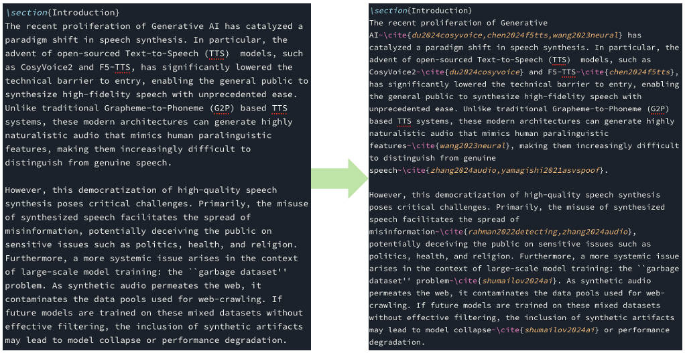

# CiteAgent - Overleaf 자동 인용 추가 도구

[**English Version**](README_EN.md) | 한국어

**News** 
- [KyuCite](https://chromewebstore.google.com/detail/kyucite-academic-citation/enmmkcophhilimigcanalmlaffihpoca), version of Chrome extension is out!

<br>

CiteAgent는 Overleaf에서 작성 중인 LaTeX 논문에 자동으로 적절한 인용을 추가해주는 AI 기반 도구입니다.

## 주요 기능

- 🤖 **Gemini API** 또는 **Upstage API** 사용 (선택 가능)
- 📚 Semantic Scholar를 통한 실시간 논문 검색
- 🔍 자동으로 가장 관련성 높은 논문 선택
- ✍️ LaTeX 문서에 `\cite{}` 태그 자동 삽입
- 📝 BibTeX 엔트리 자동 생성 및 mybib.bib에 추가
- 🍎 **Safari에서 Overleaf 자동화** (macOS)

## 목차

- [설치 방법](#설치-방법)
- [설정](#설정)
- [사용 방법](#사용-방법)
- [작동 원리](#작동-원리)
- [문제 해결](#문제-해결)

---

## 설치 방법

### 1. 저장소 클론

```bash
git clone https://github.com/KyuDan1/citeAgent.git
cd citeAgent
```

### 2. Conda 가상환경 생성 및 활성화

```bash
# Conda 환경 생성 (Python 3.10 이상 권장)
conda create -n citeagent python=3.10

# 환경 활성화
conda activate citeagent
```

### 3. 의존성 설치

```bash
pip install -r requirements.txt
```

---

## 설정

### 1. 설정 파일 확인

프로젝트 루트에 `config.yaml` 파일이 있습니다. 이 파일에서 API 키와 LLM provider를 설정합니다.

### 2. LLM Provider 선택

`config.yaml` 파일을 열어 사용할 LLM을 선택하세요:

```yaml
llm:
  provider: "gemini"  # "gemini" 또는 "upstage" 선택
```

### 3. API 키 설정

#### Gemini API 사용 시:

```yaml
llm:
  provider: "gemini"

gemini:
  api_key: "여기에_실제_Gemini_API_키_입력"
  model: "gemini-3-flash-preview"
```

**Gemini API 키 발급 방법:**
1. [Google AI Studio](https://aistudio.google.com/apikey)에 접속
2. Google 계정으로 로그인
3. "Get API Key" 클릭하여 새 키 생성
4. 생성된 키를 복사하여 `config.yaml`에 붙여넣기

#### Upstage API 사용 시:

```yaml
llm:
  provider: "upstage"

upstage:
  api_key: "여기에_실제_Upstage_API_키_입력"
  base_url: "https://api.upstage.ai/v1"
  model: "solar-pro2"
```

**Upstage API 키 발급 방법:**
1. [Upstage Console](https://console.upstage.ai/)에 접속
2. 회원가입 또는 로그인
3. API Keys 메뉴에서 새 키 생성
4. 생성된 키를 복사하여 `config.yaml`에 붙여넣기

### 4. (선택사항) Semantic Scholar API 키

더 많은 API 호출을 위해 Semantic Scholar API 키를 설정할 수 있습니다:

```yaml
semantic_scholar:
  api_key: ""  # 선택사항 - 없어도 작동함
```

**발급 방법:**
1. [Semantic Scholar API](https://www.semanticscholar.org/product/api) 페이지 방문
2. API Key 신청


### 5. Overleaf 프로젝트 URL 설정

작업할 Overleaf 프로젝트의 URL을 설정하세요:

```yaml
overleaf:
  project_url: "https://www.overleaf.com/project/your-project-id"
```

**URL 찾는 방법:**
1. Overleaf에서 프로젝트 열기
2. 브라우저 주소창의 URL 전체를 복사
3. `config.yaml`에 붙여넣기

---

## 사용 방법

### 준비 단계

1. **Safari에서 Overleaf 열기 (필수)**
   - Safari 브라우저 실행
   - Overleaf 프로젝트 열기
   - 편집할 `.tex` 파일 선택
   - **⚠️ 중요: CiteAgent 실행 중에는 Safari에서 Overleaf가 계속 열려 있어야 합니다**

   **Safari 개발자 설정 (필수):**
   - Safari > 환경설정 > 고급 > "메뉴 막대에서 개발자용 메뉴 보기" 체크
   - Safari > 개발자 메뉴 > 자동화 (Automation) 선택
   - 다음 **세 가지 옵션 모두 체크**:
     - ✅ 원격 자동화 허용 (Allow Remote Automation)
     - ✅ 스마트 검색 필드에서 JavaScript 허용 (Allow JavaScript from Smart Search Field)
     - ✅ Apple 이벤트에서 JavaScript 허용 (Allow JavaScript from Apple Events)

2. **Conda 환경 활성화**
   ```bash
   conda activate citeagent
   ```

### 모드 1: Interactive 모드 (권장)

텍스트를 선택하고 처리하는 대화형 모드입니다.

```bash
python main.py --interactive
```

**사용 순서:**
1. **Overleaf 에디터에서 인용이 필요한 텍스트를 마우스로 드래그하여 선택**
2. **터미널에서 Enter 키 입력**
3. Agent가 자동으로 논문을 검색하고 인용 추가
4. 터미널에 결과가 출력됨 - 수정된 텍스트와 BibTeX 확인
5. 적용 여부 선택 (`yes` 입력 시 Overleaf에 적용)
6. 적용하면:
   - 선택한 텍스트가 인용과 함께 교체됨
   - BibTeX 엔트리가 `mybib.bib`에 자동 추가됨
7. 계속하려면 다시 텍스트 선택 후 Enter, 종료하려면 `Ctrl+C`

**예시:**
```
[사용자] Overleaf에서 "WavLM is a self-supervised model" 텍스트 선택
[사용자] 터미널에서 Enter 입력
[Agent] 논문 검색 중...
[Agent] WavLM 논문 발견 및 BibTeX 생성
[Agent] 수정된 텍스트: "WavLM~\cite{chen2022wavlm} is a self-supervised model"
[사용자] "yes" 입력하여 적용
[결과] Overleaf에서 인용 추가되고, mybib.bib에 BibTeX 항목 자동 추가됨
```


**주의사항:**
- ⚠️ 문서 전체가 변경될 수 있으므로 **백업 권장**
- ⚠️ 처리 시간이 길 수 있음 (문서 길이에 따라)
- ⚠️ 적용 전 반드시 결과 검토

### 모드 3: File 모드

Overleaf 없이 로컬 `.tex` 파일을 처리합니다.

```bash
python main.py --file document.tex
```

**출력:**
- `document_cited.tex` - 인용이 추가된 문서
- `document_cited.bib` - BibTeX 엔트리들

**장점:**
- ✅ Overleaf 연결 불필요
- ✅ 오프라인 작업 가능
- ✅ 버전 관리 용이

---

## 작동 원리


### 처리 과정

1. **텍스트 읽기**
   - Safari에서 Overleaf 편집기의 텍스트를 AppleScript로 읽음
   - 또는 사용자가 선택한 텍스트만 읽음

2. **텍스트 분석**
   - LLM(Gemini 또는 Upstage)이 LaTeX 텍스트를 읽고 인용이 필요한 부분 식별
   - **Abstract 섹션은 자동으로 건너뜀**
   - 모델명, 방법론, 데이터셋 등 인용이 필요한 개념 파악

3. **논문 검색**
   - 식별된 개념에 대해 Semantic Scholar API로 관련 논문 검색
   - 검색어는 **최대 3단어**로 간결하게 생성
   - 예: "WavLM", "t-SNE visualization", "PCA analysis"

4. **논문 선택**
   - 검색 결과에서 인용 횟수, 연도, 관련성을 고려하여 최적의 논문 선택
   - 고인용 논문 우선 선택

5. **BibTeX 생성**
   - 선택된 논문의 메타데이터로 BibTeX 엔트리 자동 생성
   - 표준 BibTeX 형식 준수

6. **인용 삽입**
   - 적절한 위치에 `\cite{key}` 태그 삽입
   - 여러 논문 인용 시: `\cite{key1,key2,key3}`
   - 문장 중간에도 삽입 가능 (예: "WavLM~\cite{chen2022wavlm} is...")

7. **Overleaf 적용**
   - **청크 기반 방식**으로 큰 파일도 안전하게 처리
   - AppleScript의 길이 제한을 우회하기 위해 2000자씩 나누어 전송
   - Safari에서 Overleaf 편집기에 수정된 텍스트 반영
   - `mybib.bib` 파일에 BibTeX 엔트리 자동 추가

### LLM Function Calling

CiteAgent는 LLM의 Function Calling 기능을 사용합니다:

**사용 가능한 도구:**
- `search_paper(query, limit)`: 논문 검색
  - 최대 3단어의 간결한 검색어 사용
  - 기본 5개 결과 반환
- `get_bibtex(paper_key)`: BibTeX 엔트리 생성
  - 각 논문마다 **개별적으로** 호출

LLM이 스스로 필요한 도구를 호출하므로, 환각(hallucination) 없이 **실제 존재하는 논문만** 인용합니다.

### 청크 기반 파일 쓰기

AppleScript의 명령어 길이 제한을 해결하기 위해 특수한 방식을 사용합니다:

1. 큰 콘텐츠를 2000자씩 청크로 분할
2. JavaScript 배열에 각 청크를 `push()`
3. 모든 청크를 `join('')`으로 합침
4. 합쳐진 내용을 CodeMirror 에디터에 씀

이 방식으로 **5800자 이상의 큰 파일도 안전하게 처리** 가능합니다.

---

## 문제 해결

### 1. "Could not connect to Safari" 에러

**원인:** Safari가 실행되지 않았거나 Overleaf가 열려있지 않음

**해결:**
- Safari 실행 확인
- Overleaf 프로젝트가 열려있는지 확인
- `config.yaml`의 `project_url`이 올바른지 확인

### 2. "File 'mybib.bib' not found" 에러

**원인:** Overleaf 프로젝트에 mybib.bib 파일이 없음

**해결:**
1. Overleaf 프로젝트에서 새 파일 생성
2. 파일명을 `mybib.bib`로 설정
3. 빈 파일로 저장
4. 다시 시도

또는 다른 이름의 .bib 파일이 있다면:
- `references.bib`, `bibliography.bib`, `refs.bib` 등도 자동으로 찾아서 사용

### 3. "Editor not ready" 에러

**원인:** Overleaf 편집기가 완전히 로드되지 않음

**해결:**
- 페이지 새로고침 후 재시도
- `.tex` 파일이 실제로 에디터에 열려있는지 확인
- 몇 초 기다린 후 다시 시도

### 4. API 키 에러

**원인:** API 키가 유효하지 않거나 설정되지 않음

**해결:**
- `config.yaml`에서 API 키 확인
- API 키에 공백이나 따옴표가 잘못 들어가지 않았는지 확인
- Gemini/Upstage 콘솔에서 API 키 상태 확인
- 환경변수 사용 시: `export GEMINI_API_KEY="your-key"`

### 5. 논문 검색 결과 없음

**원인:** 검색어가 너무 구체적이거나 일반적임

**해결:**
- 더 일반적인 키워드로 검색 (예: "transformer" 대신 "attention mechanism")
- Semantic Scholar에서 해당 분야 논문이 있는지 확인
- Semantic Scholar API 상태 확인

### 6. BibTeX가 추가되지 않음

**원인:** mybib.bib 파일로 전환하지 못함

**해결:**
- 터미널에 출력된 BibTeX 엔트리를 수동으로 복사
- Overleaf에서 mybib.bib 파일을 열어두고 재시도
- 파일명이 정확히 `mybib.bib`인지 확인

### 7. "Empty JavaScript result" 에러

**원인:** AppleScript 명령이 실패함 (드물게 발생)

**해결:**
- Safari 재시작
- Overleaf 페이지 새로고침
- macOS 권한 설정에서 터미널의 접근성 권한 확인

---

## 고급 사용법

### 환경변수로 API 키 관리

```bash
# .bashrc 또는 .zshrc에 추가
export GEMINI_API_KEY="your_api_key_here"
# 또는
export UPSTAGE_API_KEY="your_api_key_here"

# 사용
python main.py --interactive
```

### Python 스크립트로 통합

```python
from src.citation_agent import CitationAgent
from src.config import Config

# 설정 로드
config = Config("config.yaml")
llm_config = config.get_llm_config()

# Agent 초기화
if llm_config["provider"] == "gemini":
    agent = CitationAgent(
        provider="gemini",
        api_key=llm_config["api_key"],
        model=llm_config["model"]
    )
else:
    agent = CitationAgent(
        provider="upstage",
        api_key=llm_config["api_key"],
        model=llm_config["model"]
    )

# 텍스트 처리
text = "Transformers have revolutionized NLP."
modified, bibtex = agent.process_text(text)

print("Modified:", modified)
print("BibTeX:", bibtex)
```

### 커스텀 BibTeX 파일명 사용

프로젝트에서 다른 이름의 .bib 파일을 사용하는 경우:

1. Safari에서 Overleaf를 열고 해당 .bib 파일을 클릭
2. 파일이 열린 상태에서 agent 실행
3. 또는 파일명을 `mybib.bib`, `references.bib`, `bibliography.bib`, `refs.bib` 중 하나로 변경

---

## 프로젝트 구조

```
citeAgent/
├── main.py                          # 메인 실행 파일
├── requirements.txt                 # Python 의존성
├── config.yaml                      # 설정 파일
├── README.md                        # 이 문서
├── test_agent.py                    # 테스트 스크립트
└── src/
    ├── __init__.py
    ├── config.py                    # 설정 관리
    ├── paper_search.py              # Semantic Scholar 연동
    ├── citation_agent.py            # LLM Agent 로직
    └── safari_applescript_controller.py  # Safari 제어
```

---

## 주의사항

- ⚠️ 이 도구는 **연구 보조 목적**으로 제작되었습니다
- ⚠️ 생성된 인용은 **반드시 검토하고 확인**해야 합니다
- ⚠️ 부정확한 인용이나 저작권 문제에 대한 책임은 사용자에게 있습니다
- ⚠️ Overleaf의 자동 저장 기능으로 변경사항이 자동 저장되므로, 중요한 작업 전 **백업을 권장**합니다
- ⚠️ Abstract 섹션(`\begin{abstract}...\end{abstract}`)에는 자동으로 인용이 추가되지 않습니다

---

## 라이선스

MIT License

## 참고 자료

- [Google Gemini API](https://ai.google.dev/)
- [Upstage API 문서](https://developers.upstage.ai/)
- [Semantic Scholar API](https://api.semanticscholar.org/)
- [Overleaf](https://www.overleaf.com/)

---

